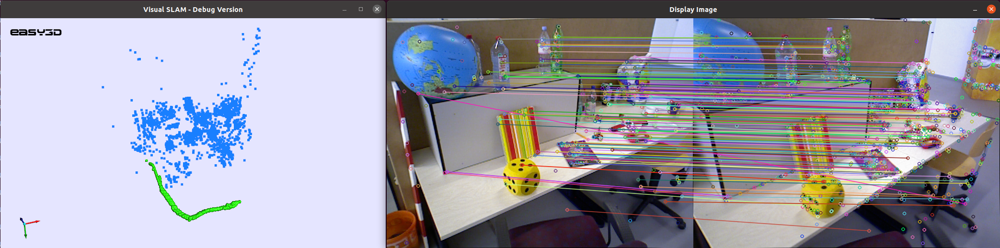

# Visual Slam

Visual Simulatenous Localization and Mapping (visual SLAM) is 3D map building process from video input. The aim is to estimate 3D locations for objects seen during the video and transformations for camera position between video frames. This is done using computer vision techniques. These estimates are then optimized using graph optimization. The map, which consists out of the 3D locations of objects and camera poses (only locations currently), is then visualized.

Our SLAM implementation follows the ORB-SLAM paper (Mur-Artal et al., 2015), and implements map initialization (Map::initializeMap()), tracking (Map::localTracking()) and new point mapping (Map::localMapping()) using OpenCV algorithms. This is the so called frontend of SLAM. We also implement bundle adjustment to optimize the estimated map points and poses (Map::BundleAdjustement()) using g2o.

# How to compile:

Requirements: 
- OpenCV https://opencv.org
- Eigen3 http://eigen.tuxfamily.org
    - In linux: sudo apt install libeigen3-dev
- g2o https://github.com/RainerKuemmerle/g2o
- Easy3D https://github.com/LiangliangNan/Easy3D
- cmake (compiled with VERSION 3.11.0)
- C++14 compiler

Libraries (apart from Eigen3) can be installed from the links or just by building them from the /libs folder. We recommend that in addition to make, one also puts sudo make install, as this installs them to /.../local/include folder where our program looks for them.

After installing the requirements, we recommend a so-called out of source build which can be achieved by the following command sequence:
- cd path-to-cmakelist
- mkdir build
- cd build
- cmake ../
- make

This creates a run file named “run_slam”, which you can run using ./run_slam while in the build directory.

# Group
- Juuso Korhonen
- Jere Knuutinen
- Olivia Palmu

# TODOs
- Olivia: add better visualization for camera poses.
- Juuso and Jere: add filtering for bad points and poses.
